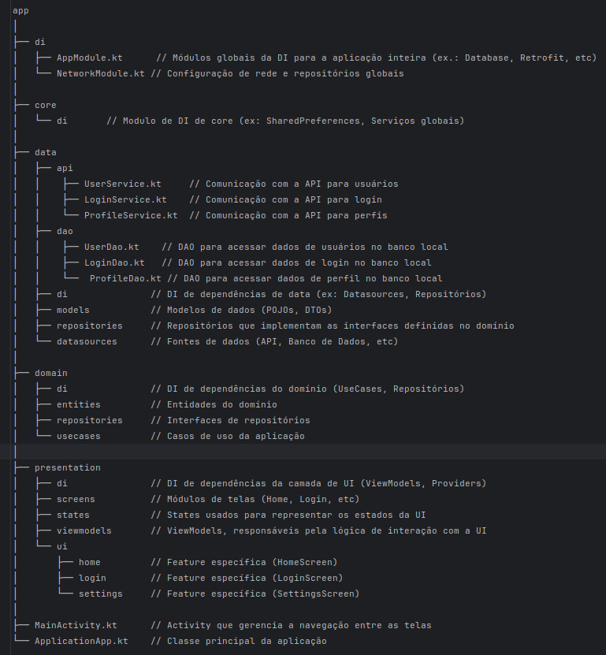

## Arquitetura android Jetpack compose

* Kotlin
* JetPack Compose
* Coroutines
* Hilt - Dagger
* Retrofit
* Room
* RoboEletric JUni4 - Mockito - NavigationTestingKtx

app
│
├── di
│   ├── AppModule.kt      // Módulos globais da DI para a aplicação inteira (ex.: Database, Retrofit, etc)
│   └── NetworkModule.kt // Configuração de rede e repositórios globais
│
├── core
│   └── di       // Modulo de DI de core (ex: SharedPreferences, Serviços globais)
│
├── data
│   ├── api
│   │    ├── UserService.kt     // Comunicação com a API para usuários
│   │    ├── LoginService.kt    // Comunicação com a API para login
│   │    └── ProfileService.kt  // Comunicação com a API para perfis
│   ├── dao
│   │    ├── UserDao.kt    // DAO para acessar dados de usuários no banco local
│   │    ├── LoginDao.kt   // DAO para acessar dados de login no banco local
│   │    └──  ProfileDao.kt // DAO para acessar dados de perfil no banco local
│   ├── di               // DI de dependências de data (ex: Datasources, Repositórios)
│   ├── models           // Modelos de dados (POJOs, DTOs)
│   ├── repositories     // Repositórios que implementam as interfaces definidas no domínio
│   └── datasources      // Fontes de dados (API, Banco de Dados, etc)
│
├── domain
│   ├── di               // DI de dependências do domínio (UseCases, Repositórios)
│   ├── entities         // Entidades do domínio
│   ├── repositories     // Interfaces de repositórios
│   └── usecases         // Casos de uso da aplicação
│
├── presentation
│   ├── di               // DI de dependências da camada de UI (ViewModels, Providers)
│   ├── screens          // Módulos de telas (Home, Login, etc)
│   ├── states           // States usados para representar os estados da UI
│   ├── viewmodels       // ViewModels, responsáveis pela lógica de interação com a UI
│   └── ui
│       ├── home         // Feature específica (HomeScreen)
│       ├── login        // Feature específica (LoginScreen)
│       └── settings     // Feature específica (SettingsScreen)
│
├── MainActivity.kt      // Activity que gerencia a navegação entre as telas
└── ApplicationApp.kt    // Classe principal da aplicação

Explicação:
data/api/: Contém as interfaces para os serviços que fazem chamadas de rede (API) usando algo como Retrofit. 
Os serviços são responsáveis por fazer as requisições HTTP.

data/dao/: Contém os DAOs que são responsáveis por acessar o banco de dados local (usando Room, por exemplo). 
Cada entidade que você salvar localmente teria seu respectivo DAO.

data/repository/: O Repository é a camada que atua como intermediária entre os dados locais e remotos. 
Ele pode fazer requisições à API quando necessário e também acessar os dados locais. 
A lógica de como combinar os dados remotos e locais fica aqui.